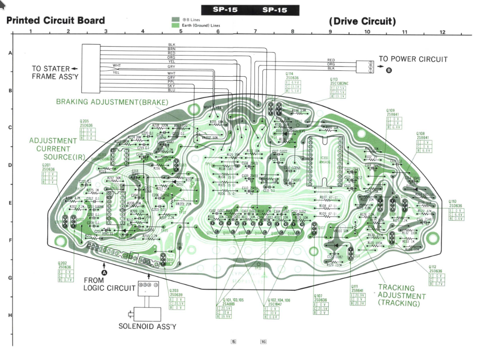
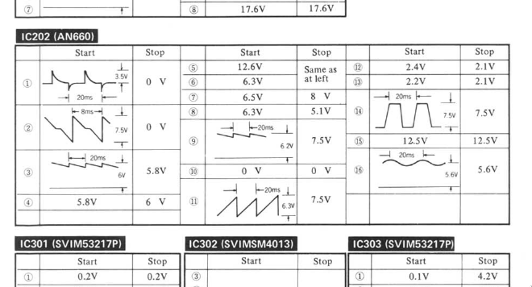
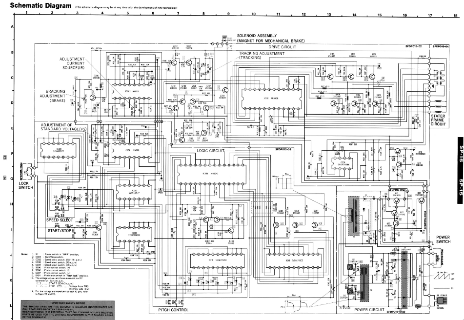
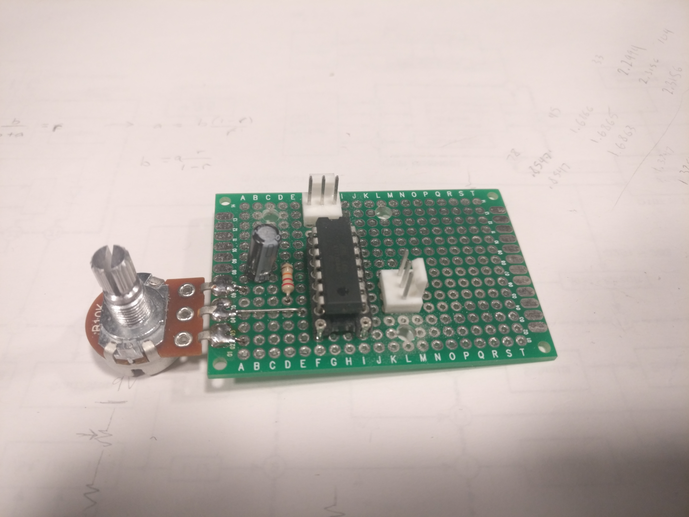
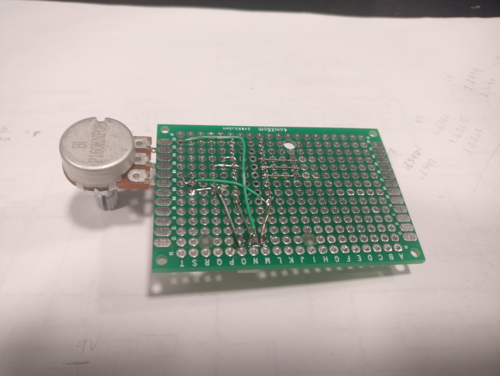
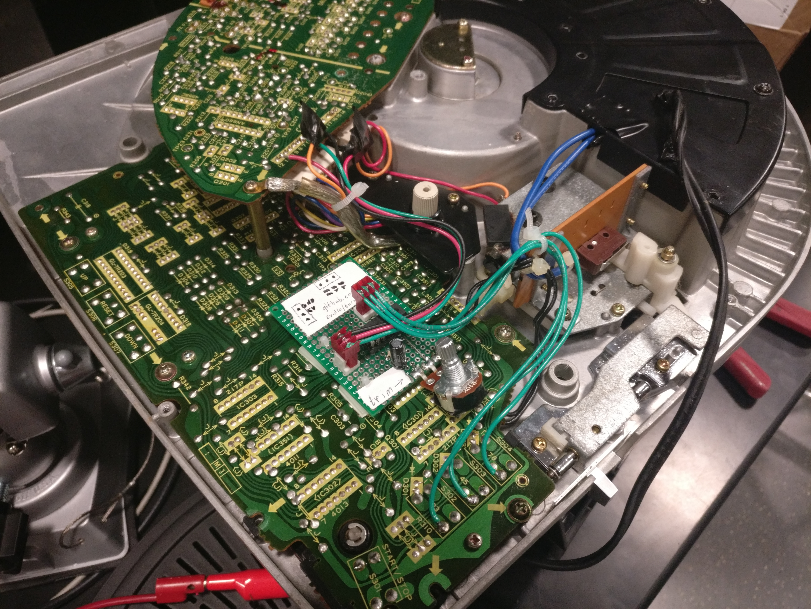

# turntable

This is a quick repair of a broken Technics SP15 turntable.  This table spins way too fast and at inconsistent speeds.

The repair manuals on these old turntables are quite good and give full schematics and troubleshooting instructions along with expected waveforms at specific pins.

I managed to track the issue to a specific custom Technics IC on one of the boards.  Unfortunately it's hard to find and expensive nowadays.

Instead I decided to just completely (non-destructively) bypass the control board) with an Arduino spitting out RC-filtered PWM at one of three duty cycles for 33/45/78 rpm records.  I wired the buttons directly to digital IO on the Arduino and inject the PWM into the control board (which has a convenient connector).  There is also a potentiometer for manually retuning rpm.

I don't have a Tachometer for tuning the speed of the table, so I taped a metal screwdriver to the platter so that it would bump against an oscilloscope probe where I can measure the exact frequency.

With the way I've repaired it the table is no longer with closed-loop speed control, but at least it spins.